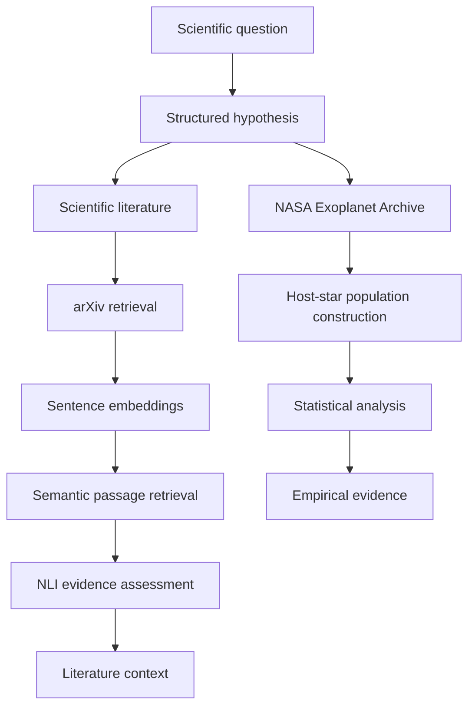
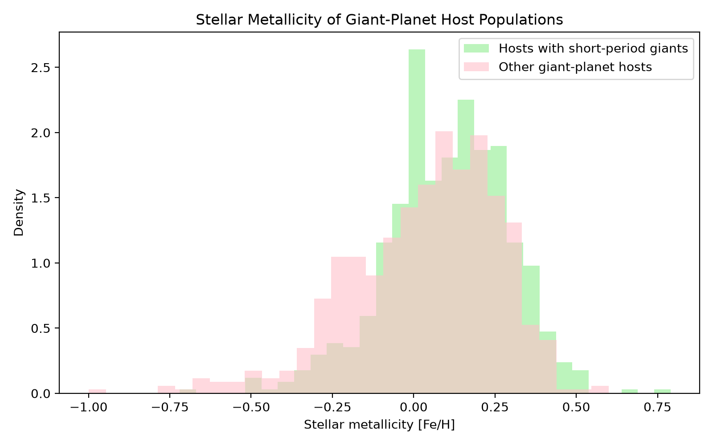

# Astrophysical Lab

<a href="https://github.com/chaouin/astrophysical-lab/actions/workflows/ci.yml">
  
</a>

Astrophysical Lab is a side project I built to explore the intersection of
NLP and scientific discovery. Since astrophysics is one of my personal
interests outside my own research, I chose it as the scientific domain
for this experiment.

It is a small NLP and scientific-computing pipeline that connects scientific
literature to structured hypotheses and empirical validation using real
astrophysical data.

The project explores a simple question:

> **Are short-period giant planets preferentially found around metal-rich stars?**

The goal is not to perform novel astrophysical research here. Instead,
Astrophysical Lab demonstrates how semantic retrieval, natural language
inference (NLI), structured scientific hypotheses, observational data, and
statistical testing can be combined in a reproducible software pipeline.

---

## Overview

Astrophysical Lab follows two complementary evidence paths.



The NLP branch identifies relevant scientific statements and estimates
whether they support, contradict, or remain neutral toward a literature
claim.

The empirical branch independently tests a more specific hypothesis using
observational data from the NASA Exoplanet Archive.

NLI predictions are treated only as heuristic language-model signals.
The empirical conclusion is produced independently using deterministic
statistical analysis.

---

## Experiment

### Scientific hypothesis

The empirical hypothesis tested by the pipeline is:

> Host stars of short-period giant planets have higher stellar metallicity
> than other giant-planet hosts.

For this experiment:

- giant planets have masses between `0.3` and `13` Jupiter masses;
- short-period giants have orbital periods of at most `10` days;
- each host star is counted once;
- stellar metallicity `[Fe/H]` is the dependent variable;
- the populations are compared using a two-sided Mann-Whitney U test;
- rank-biserial correlation is reported as an effect-size measure.

---

## NLP pipeline

### Scientific literature retrieval

Relevant papers are retrieved from arXiv and their abstracts are segmented
into sentence-level passages.

A Sentence Transformer bi-encoder maps the literature claim and passages
into semantic embeddings. Cosine similarity is then used to retrieve the
most relevant passages.

Default retrieval model:

```text
sentence-transformers/multi-qa-MiniLM-L6-cos-v1
```

### Natural language inference

Retrieved passages are evaluated using a pretrained NLI cross-encoder:

```text
cross-encoder/nli-MiniLM2-L6-H768
```

Each passage receives one of three evidence labels:

```text
SUPPORT
NEUTRAL
CONTRADICT
```

Low-confidence predictions are conservatively mapped to `NEUTRAL`.

The NLI component is intentionally treated as heuristic. Generic NLI models
can misinterpret hedged or domain-specific scientific language, so these
predictions are not used as empirical validation.

---

## Empirical validation

The pipeline retrieves exoplanet and host-star properties from the
NASA Exoplanet Archive.

Planet-level observations are collapsed to host-star-level populations to
avoid treating multiple planets around the same star as independent stellar
metallicity measurements.

The two host populations are then compared using the Mann-Whitney U test.

### Example result

An example run on September 15, 2026 produced:

| Population | n | Median [Fe/H] |
|---|---:|---:|
| Hosts with short-period giant planets | 670 | 0.110 |
| Other giant-planet hosts | 644 | 0.074 |

```text
Mann-Whitney U
p-value:     6.214e-06
effect size: 0.144
evidence:    SUPPORTED
```

Under the population definitions used in this experiment, the observed
sample supports the hypothesis that hosts of short-period giant planets tend
to have higher stellar metallicity.

The effect is statistically detectable but modest in magnitude.



---

## Installation

Clone the repository:

```bash
git clone https://github.com/chaouin/astrophysical-lab.git
cd astrophysical-lab
```

Create a virtual environment:

```bash
python -m venv .venv
source .venv/bin/activate
```

Install the package:

```bash
python -m pip install -e ".[dev]"
```

The project requires Python 3.11 or newer.

---

## Usage

Run the complete investigation:

```bash
astrolab investigate
```

Control literature retrieval:

```bash
astrolab investigate --max-papers 20 --top-k 5
```

Return the complete structured report as JSON:

```bash
astrolab investigate --json
```

The first run downloads the pretrained embedding and NLI models so it may take some time.

---

## Project structure

```text
astrophysical-lab/
├── examples/
│   └── run_investigation.py
├── src/
│   └── astrophysical_lab/
│       ├── analysis/
│       │   ├── populations.py
│       │   └── statistics.py
│       ├── data/
│       │   └── nasa_exoplanet.py
│       ├── literature/
│       │   ├── arxiv_client.py
│       │   ├── nli.py
│       │   └── retriever.py
│       ├── cli.py
│       ├── config.py
│       ├── experiment.py
│       ├── hypothesis.py
│       ├── models.py
│       ├── pipeline.py
│       └── reporting.py
├── tests/
├── docs/
├── pyproject.toml
└── README.md
```

---

## Testing

Run the test suite:

```bash
python -m pytest -v
```

Run static checks:

```bash
ruff check .
```

The tests cover population construction, statistical interpretation,
semantic passage processing, conservative NLI labeling, and the command-line
interface.

---

## Design principles

The project intentionally separates language-model components from empirical
validation.

Semantic retrieval answers:

> Which scientific passages are relevant to the claim?

NLI estimates:

> How does a retrieved passage relate linguistically to the claim?

Statistical analysis answers:

> Does the observational sample support the empirical hypothesis?

This separation prevents a language model from directly determining the
scientific conclusion.

---

## Limitations

This is a small demonstration system rather than a full astrophysical research study.

The current implementation tests one predefined hypothesis and one population
definition. arXiv and NASA Archive results may change as their databases are
updated.

The generic NLI model can also misclassify scientific statements,
particularly hedged, interrogative, or domain-specific language. Its output
should therefore be interpreted as a retrieval aid rather than scientific
evidence.

Finally, the statistical analysis measures an observational association and
does not establish causality.

---

## Technologies

<p align="left">
  
  
  
  
  
</p>

<p align="left">
  
  
  
  
</p>